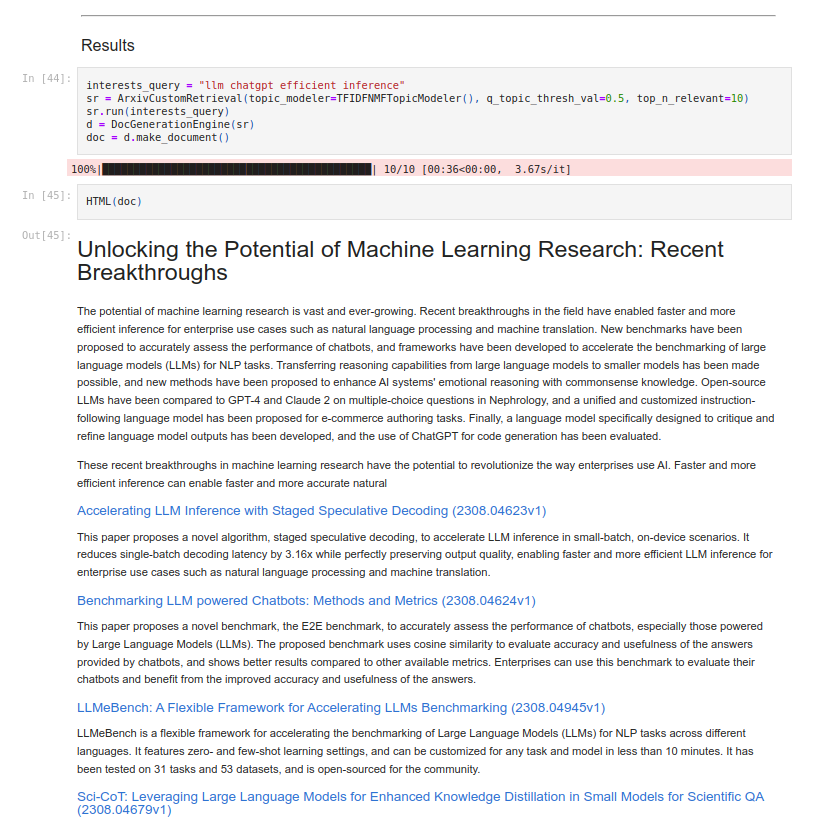

# 🤓 ArxivHero

This is a hyper-specialized arxiv summarizer. 

The source of inspiration was [this video](https://youtu.be/u4CRHtjyHTI?t=3303).

A script that uses this library is run daily at 8:00 am (if my server is up and my GPU not otherwise busy) and saves updates [here](https://mylonasc.github.io/arxiv_llm_assistant/).

<details>

<summary> 🤔 FAQ </summary>

### How is this different from searching arxiv and reading the abstracts?
The point of this summarizer, is to implement further customization 
facilities, to allow for a more personalized digest experience. 

Eventually the goal is to have some basic paper metrics and better topic modeling based on citations and/or the knowledge of the reader (e.g., I don't need an explanation of transformers, whereas someone else might need one. Or, an electrical engineer may be interested in different types of transformers! (if it's not an electrical engineer working on LLMs...)

### How is this different from other summarizers?
There is a similar and more mature paper summarizer called [arxivDigest](https://github.com/AutoLLM/ArxivDigest).

There are 2 main differences with the existing repo:
1. `arxiv_hero` performs re-ranking (using both embeddings) and topic modeling (using NMF/bag-of-words/tf-idf) and filtering according to the query for the retrieved results,
2. `arxiv_hero` performs ontologically configurable summarization, that includes the users' intent. 

See, for instance, the `Enum` classes `SummaryFocus` and `FlatDomainOntology`. These enums contain some simple strings, that are used in the prompts 
to encode the intent of the target user in both the top-level summary and in the abstract summary. 
</details>

----
## Usage
Currently this contains just a notebook with everything needed (arxiv query manager, topic modeler, topic filtering, re-ranker, embedder, generative model language engine etc).

The lines that actually produce the output are the following (see "results" section in notebook)
```python
interests_query = "llm chatgpt efficient inference"
sr = ArxivCustomRetrieval(topic_modeler=TFIDFNMFTopicModeler(), q_topic_thresh_val=0.5, top_n_relevant=10)
sr.run(interests_query)
d = DocGenerationEngine(sr)
doc = d.make_document()
```

Here is an example output:


## Limmitations/planned extensions
This is at a work-in-progress stage at the moment. Plan is to operationalize this somehow. 

It will probably be extended to support more sources and do some more OSINT on the retrieved papers.


